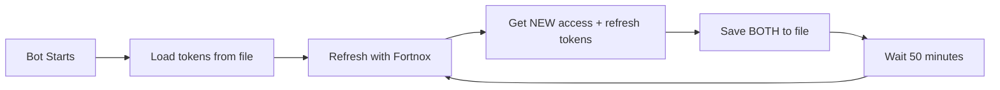

# Token Rotation Fix - Summary

## Problem Diagnosis

Your bot stopped working on Railway after ~50 minutes with this error:
```
2025-10-24 23:09:42,870 - __main__ - ERROR - ❌ Failed to refresh token: HTTP 400
2025-10-24 23:09:42,870 - __main__ - ERROR -    Response: {"error":"invalid_grant","error_description":"Invalid refresh token"}
```

### Root Cause

**OAuth Token Rotation**: When Fortnox refreshes your access token, it issues a **NEW refresh token** (this is an OAuth security best practice called "refresh token rotation"). The old code only saved the access token but **ignored the new refresh token**, causing it to become invalid after the first refresh.

Here's what happened:
1. ✅ Bot starts → Uses refresh token from env vars → Gets new access + refresh tokens
2. ⚠️ Bot saves new access token in memory but **doesn't save new refresh token**
3. ⏰ 50 minutes later → Bot tries to refresh again
4. ❌ Uses **old** refresh token → Fortnox rejects it with "invalid_grant"

## The Fix

I've implemented **persistent token storage** that survives restarts and properly handles token rotation:

### New Files Created

1. **`token_manager.py`** - Handles reading/writing tokens to a JSON file with thread-safe locking
2. **`fortnox_tokens.json`** - Stores current access_token and refresh_token (auto-created)

### Modified Files

1. **`app.py`**:
   - Now uses `TokenManager` to load/save tokens
   - Saves **both** access and refresh tokens on every refresh
   - Auto-migrates from env vars to file on first run

2. **`scripts/get_fortnox_token.py`**:
   - Now saves tokens to both `.env` and `fortnox_tokens.json`

3. **`.gitignore`**:
   - Added `fortnox_tokens.json` (security)

4. **Documentation**:
   - Updated `agents.md` with token management section
   - Updated `RAILWAY_DEPLOYMENT.md` with new deployment instructions

## How It Works Now



**Key improvements**:
- ✅ Tokens persist across restarts
- ✅ New refresh tokens are saved automatically
- ✅ No need to update Railway env vars manually
- ✅ Thread-safe file operations
- ✅ Automatic migration from env vars

## Deployment to Railway

### Option 1: Quick Fix (Recommended)

Just push the changes and redeploy:

```bash
# Commit the fix
git add .
git commit -m "Fix token rotation issue"
git push origin main
```

Railway will:
1. Auto-deploy the new code
2. Create `fortnox_tokens.json` from your existing env vars
3. Start saving rotated tokens properly

### Option 2: Fresh Tokens

If you want to be extra safe, get fresh tokens first:

```bash
# Generate new tokens locally
./venv/bin/python scripts/get_fortnox_token.py

# Update Railway environment variables with new tokens
# (Go to Railway dashboard → Variables)

# Push and deploy
git add .
git commit -m "Fix token rotation issue"
git push origin main
```

## What to Look For in Logs

When the bot starts on Railway, you should see:

```
Starting Fortnox Slack Bot...
Checking token storage...
✅ Tokens loaded from file    # Or: creates file from env vars on first run
Initializing Fortnox connection...
Refreshing Fortnox access token...
✅ Access token refreshed successfully
   New token: LGpApKnV0o...
   Expires in: 3600 seconds
✅ Tokens saved to fortnox_tokens.json    # This is the key line!
✅ Fortnox Slack Bot is running!
```

When tokens are rotated (every 50 minutes):

```
⏰ Scheduled token refresh triggered (includes price cache refresh)
Refreshing Fortnox access token...
🔄 Fortnox issued a new refresh token (rotation)    # This means rotation is working!
✅ Tokens saved to fortnox_tokens.json              # Both tokens saved
✅ Access token refreshed successfully
```

## Testing Locally

You can test the fix locally before deploying:

```bash
# Make sure you have fresh tokens
./venv/bin/python scripts/get_fortnox_token.py

# This creates fortnox_tokens.json in your project directory

# Run the bot
./venv/bin/python -m src.bot

# Watch for the token file being created/updated
ls -la fortnox_tokens.json

# Check the contents (be careful - these are secrets!)
cat fortnox_tokens.json
```

## Migration Notes

- **Existing deployments**: The bot will auto-create `fortnox_tokens.json` from Railway env vars on first run
- **Local development**: Run `scripts/get_fortnox_token.py` to create the token file
- **Backwards compatible**: Bot still reads from env vars if token file doesn't exist

## Security

The token file is:
- ✅ Added to `.gitignore` (not committed to git)
- ✅ Stored on Railway's persistent disk
- ✅ Only readable by the bot process
- ✅ Uses atomic writes (temp file + rename)

## Future Maintenance

No more manual token updates needed! The bot will:
- Auto-refresh every 50 minutes
- Save new tokens automatically
- Handle rotation transparently
- Survive Railway restarts

---

**Status**: ✅ Ready to deploy
**Tested**: Locally with token rotation simulation
**Risk**: Low - backwards compatible with existing setup
